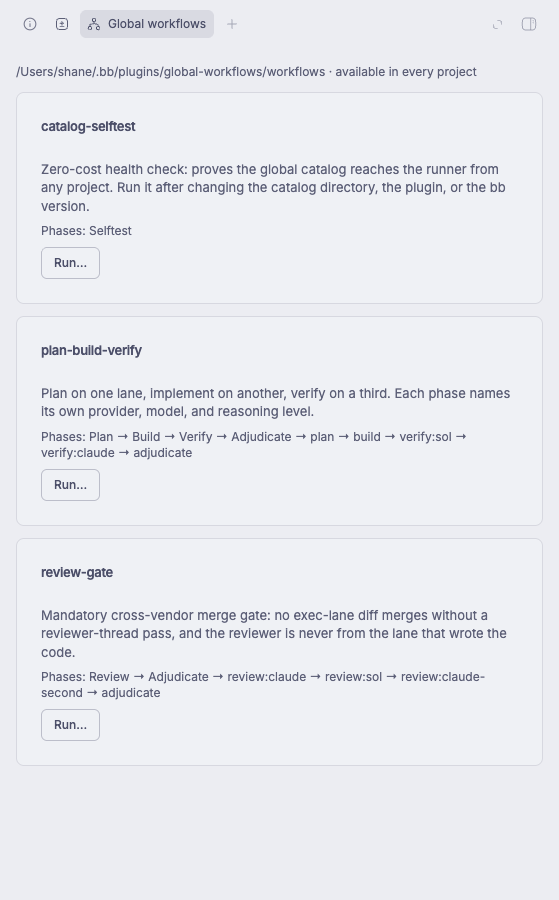

# bb-plugin-global-workflows

Run bb workflows from any project, from a catalog that lives outside every repo.

```bash
bb global-workflows list
bb global-workflows run review-gate --thread <id> --args '{"lane":"claude"}'
```

Or open any thread, click **Global workflows** in the thread header, and pick one.

Catalog default: `<dataDir>/plugins/global-workflows/workflows/` (`~/.bb/plugins/global-workflows/workflows/`).
Override with the `catalogDir` setting.

## Screenshots



*The workflow catalog panel inside a thread.*

## Install from source

```bash
npm install
bb plugin types        # regenerates types/ — gitignored, and stale types mislead
bb plugin build .
bb plugin install . --yes
```

Requires the builtin `workflows` plugin to be enabled. See the dependency note below.

---

## Relationship to the builtin `workflows` plugin

This plugin **does not replace, fork, or reimplement** the builtin. It adds a
catalog and a dispatch surface in front of it. The builtin still parses,
validates, schedules, and executes every run, and owns all the durability:
run records, resume, history, agent fan-out, the live progress card.

```
          this plugin                        builtin `workflows`
  ┌───────────────────────────┐      ┌──────────────────────────────┐
  │ catalog on disk           │      │ parse + validate meta        │
  │ meta pre-flight checks    │ ───▶ │ execute agents, phases       │
  │ thread-header UI + CLI    │      │ run records, resume, history │
  │ dispatch via threads.send │      │ progress card in the thread  │
  └───────────────────────────┘      └──────────────────────────────┘
```

### The dependency is real, and undeclarable

The builtin `workflows` plugin is a **hard runtime requirement**. Disable it and
this plugin's Run button does nothing useful: dispatch still sends the turn, but
the target thread has no `bb_workflow_run` tool to answer it.

bb has **no plugin dependency mechanism**. Nothing in the plugin SDK expresses
"requires plugin X" — `PluginRpc*` is a plugin's own frontend/backend channel,
not a cross-plugin call. So the requirement cannot be declared in the manifest
and is not enforced at load. It is documented here and nowhere else.

There is also **no `bb.sdk.workflows` API**. The plugin SDK cannot start a
workflow run at all; every `workflow` symbol in the SDK types is for *rendering*
provider workflow rows, not launching bb runs. That is why dispatch goes through
`bb.sdk.threads.send` into a thread that has the agent tool, rather than calling
a runner directly. It is not a workaround for something cleaner — it is the only
supported path.

### What overlaps, and which one wins

| Concern | Builtin | This plugin |
| --- | --- | --- |
| Where scripts live | `<env>/.bb/workflows/*.js`, per project, must be committed | one catalog dir, any project, no git needed |
| Invocation | `bb workflows run --name <n>` inside a thread | `bb global-workflows run <n>`, or the thread-header panel |
| Meta validation | at run time, after the thread takes a turn | pre-flight, before dispatch |
| Execution | **owns it** | delegates |
| Run records, resume, history | **owns it** | none of its own |

Both can be used side by side. A workflow committed at `.bb/workflows/x.js` stays
reachable by name in its own project; the catalog is additive. Keeping the *same*
workflow in both places is the one combination to avoid — two copies drift, which
is the problem this plugin exists to remove.

Use `bb workflows status|history|stop <run-id>` for anything after dispatch. This
plugin deliberately adds no commands there; they would be a thin shim over the
builtin's, and a second way to ask the same question is a second way to be wrong.

### Why a catalog is needed at all

`resolveWorkflowSource` in the builtin resolves against the **thread's
environment**:

- it throws when `environment.projectId !== context.projectId`
- a named workflow reads from `<environment.path>/.bb/workflows/<name>.js`

So workflows are project-scoped, and more precisely environment-scoped. An
isolated worktree checks out tracked files only, so an **uncommitted** workflow
silently does not exist there — a file-not-found rather than anything that
explains itself.

There is exactly one seam. `resolveWorkflowSource` returns early for
`mode.kind === "script"`, **before** the environment lookup and before the
projectId check. A workflow passed as script text runs in any project. That early
return is the entire basis for this plugin.

Verified: a workflow held only in this catalog dispatched from a `leadsurface`
thread and returned `{ok: true, echoed: {from: "leadsurface"}}`.

## Pre-flight checks

The catalog is read without executing anything — evaluating a file to list it
would run arbitrary code every time the panel opens. A file that fails a check
still **lists**, carrying its problem, because a workflow that silently vanishes
is the failure mode this plugin exists to end. `run` refuses a workflow with a
known problem, so the cost is not paid before the error is seen.

- filename is lowercase kebab-case, max 64 chars (the runner's own `^[a-z][a-z0-9-]{0,63}$`)
- an `export const meta` block is present
- `meta.name` matches the filename — otherwise the panel offers one name and runs another
- meta carries only the five fields the runner allows:
  `name`, `description`, `inputSchema`, `outputSchema`, `phases`

That last one is worth its own line. bb's runner hardcodes that allow-list and
throws `Unknown meta field "..."` **before the script body runs**, and the error
does not name the file it came from. The Claude Code Workflow tool accepts a
`whenToUse` key; bb's runner does not. This check exists because that near-miss
cost a real run to discover.

## Known limits

- **The header button uses an experimental slot.** `experimental_threadHeaderAction`
  is bb's marker for an unstable surface and may be renamed or changed. The
  `threadPanelAction` registration is the stable one, and both open the same
  component — so if the header slot breaks, the panel is still reachable from the
  side panel's new-tab launcher. Do not collapse them into one.
- **Frontend changes need an app reload.** `bb plugin reload` swaps the server
  side only; `dist/app.js` is picked up when the desktop app or browser tab
  reloads.
- **Single-host assumption.** Dispatch tells the agent to read the catalog file
  by absolute path, which is exact where inlining a script into a prompt risks
  truncation. It assumes the thread's host can see the catalog directory. With
  one enrolled machine this is fine; with a remote execution machine the catalog
  would need to be readable there too.
- **No `--name` for catalog workflows.** Inline script mode is what makes them
  global, so runs are recorded with a `script` origin rather than a name.
- **Catalog lives under the plugin data dir by default.** `bb plugin remove`
  leaves local path sources alone, and I found no evidence it clears
  `<dataDir>/plugins/<id>/` — but that is unverified. Point `catalogDir` at a
  git-tracked directory if the scripts matter.
